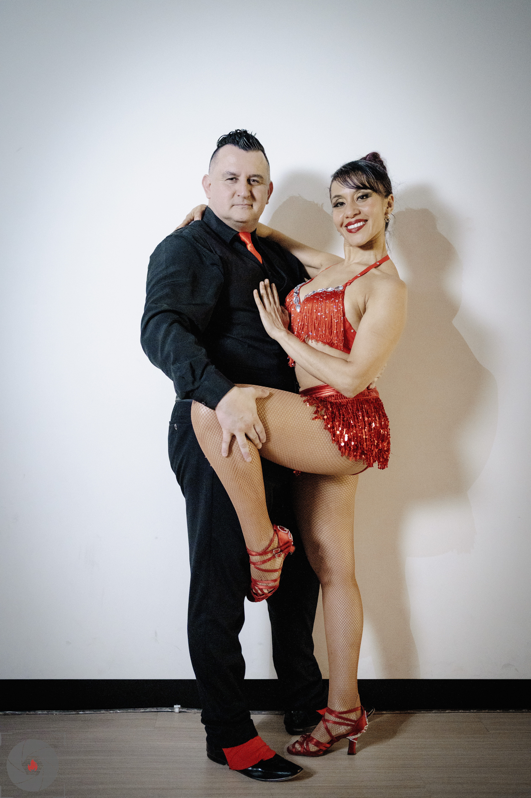
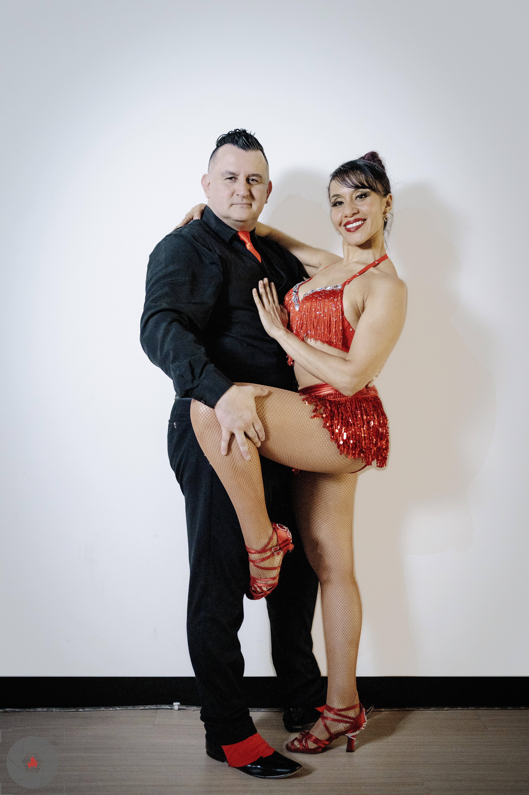

# Clean Backdrop

Free, open-source tool to clean up studio photo backdrops. Uses a three-technique approach to remove blemishes, lift shadows, and clean walls while preserving the subject perfectly.

An alternative to paid tools like Retouch4me Clean Backdrop.

### Before & After

| Before | After |
|--------|-------|
|  |  |

## How It Works

Three independent techniques, each tunable:

1. **Shadow Lift** - Blends cast shadows toward the clean wall color. No pixel replacement, just brightness/color correction. Preserves natural wall gradient.
2. **Marks & Blemishes** (LaMa) - AI inpainting on small isolated marks only (wrinkles, scuffs, seams, dust). Capped at 5% of image to prevent smudging.
3. **Subject Protection** - rembg segmentation ensures the subject is never touched. Sharp edges, no ghosting.

Works with both seamless paper backdrops and wall+floor setups. Automatically detects different floor surfaces and excludes them.

## Web UI

Local web interface with sliders, live preview, and before/after comparison.

```bash
pip install -r requirements.txt
python app_v2.py
# Open http://localhost:5000
```

- Drop images from your file explorer or paste a file path
- Adjust shadow lift strength and mark sensitivity
- Preview shows shadow lift instantly (no AI processing)
- Apply runs LaMa on detected marks at full resolution
- Save outputs next to the original with `_clean` suffix
- ICC color profiles and EXIF metadata preserved

## CLI Usage

```bash
# Basic usage
python clean_backdrop.py input.jpg

# With options
python clean_backdrop.py input.jpg --sensitivity 10 --preview

# With Stable Diffusion for removing large foreign objects
python clean_backdrop.py input.jpg --sd --preview
```

## Recommended Workflow

1. Develop your RAW files in Lightroom / Capture One
2. Export as high-quality JPEG or 16-bit TIFF
3. Drop into the web UI, tune shadow lift and mark sensitivity
4. Preview, then Apply and Save

TIFF is preferred over JPEG for this step because smooth backdrop gradients can show banding artifacts in 8-bit JPEG.

## Requirements

- Python 3.10+
- NVIDIA GPU recommended (CUDA) - works on CPU but slower
- ~200MB for LaMa model (downloaded on first run)

## License

MIT License - see [LICENSE](LICENSE) for details.
