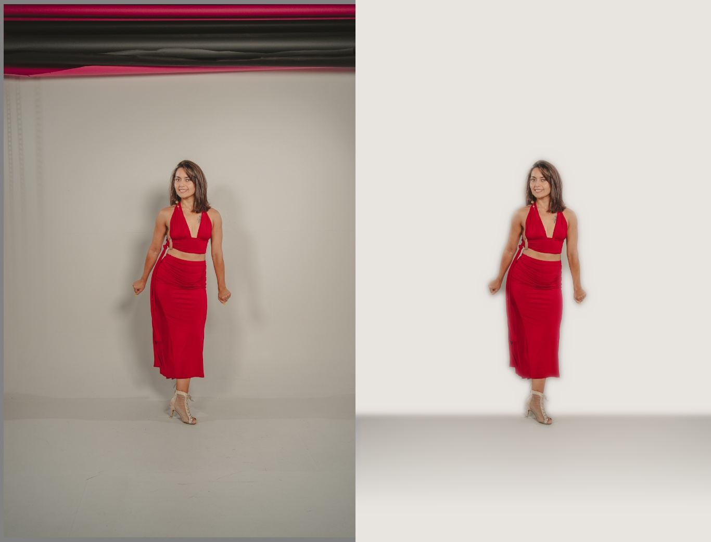

# Clean Backdrop

Free, open-source tool to clean up studio photo backdrops. Removes wrinkles, seams, uneven lighting, and other imperfections while preserving the subject and natural contact shadows.

An alternative to paid tools like Retouch4me Clean Backdrop.



## Features

- **Automatic subject segmentation** using [rembg](https://github.com/danielgatis/rembg) (U2Net)
- **Auto-detects backdrop color** or lets you specify a target color
- **Preserves contact shadows** so the subject doesn't look like they're floating
- **Feathered edges** for natural blending between subject and background
- Supports JPEG, TIFF (16-bit), and PNG output
- Side-by-side preview mode

## Installation

```bash
pip install -r requirements.txt
```

## Usage

```bash
# Basic usage (auto-detects backdrop color)
python clean_backdrop.py photo.jpg

# Specify output path
python clean_backdrop.py photo.jpg cleaned.jpg

# Specify a target backdrop color
python clean_backdrop.py photo.jpg --color "#FFFFFF"

# Generate a side-by-side comparison
python clean_backdrop.py photo.jpg --preview

# Adjust edge feathering (default: 15)
python clean_backdrop.py photo.jpg --feather 20

# Use TIFF for maximum quality
python clean_backdrop.py photo.tiff cleaned.tiff --color "#E8E4E0"
```

## Recommended Workflow

1. Develop your RAW files in Lightroom / Capture One (color correction, exposure, white balance)
2. Export as **high-quality JPEG** or **16-bit TIFF**
3. Run `clean_backdrop.py` on the exported files
4. Use the cleaned files as your final output or continue retouching

TIFF is preferred over JPEG for this step because smooth backdrop gradients can show banding artifacts in 8-bit JPEG.

## Options

| Flag | Description | Default |
|---|---|---|
| `input` | Input image path | (required) |
| `output` | Output image path | `input_clean.ext` |
| `--color` | Target backdrop color as hex (e.g. `#FFFFFF`) | Auto-detected |
| `--feather` | Edge feather amount in pixels | `15` |
| `--preview` | Save a side-by-side before/after comparison | Off |

## How It Works

1. **Segmentation** - Uses U2Net (human segmentation model) via rembg to separate subject from background
2. **Mask refinement** - Morphological operations clean up the segmentation edges
3. **Color detection** - Samples the brightest background pixels to determine the intended backdrop color
4. **Shadow preservation** - Detects contact shadows near the subject's feet and preserves them with a natural falloff
5. **Compositing** - Blends the subject over a clean, uniform background using the feathered mask
6. **Final smoothing** - Bilateral filter on background areas removes any remaining texture

## Limitations

- Works best with studio photos on solid-color backdrops (white, gray, etc.)
- Subject segmentation quality depends on the rembg model - complex poses or loose clothing may need manual touchup
- Does not handle colored/textured backdrops (muslin, painted, etc.)
- First run downloads the U2Net model (~176MB)

## License

MIT License - see [LICENSE](LICENSE) for details.
